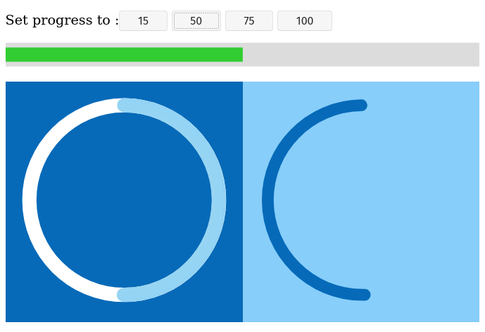

# SVG progress with anime.js

These are examples of using SVG elements as a progress indicator.
Uses anime.js v3.2.0 for animation.

There is 1 progress bar and 2 circular gauges.



## Viewing the examples

No installation needed. Simply put this repo in a directory on your web server,
say svg, then go to http://%your server url%/svg/index.html

Alternatively, if you have python3 on your OS:
```
cd svg-progress
python3 -m http.server
```

Then go to http://localhost:8000

### Installing
